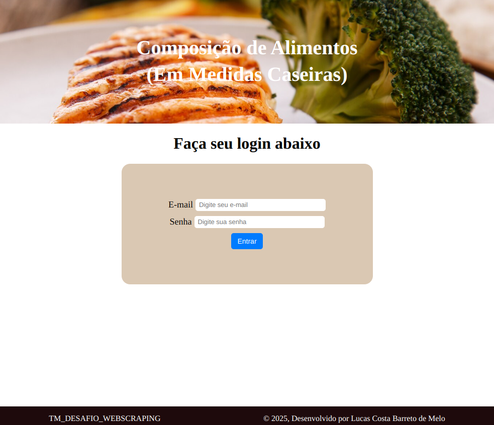
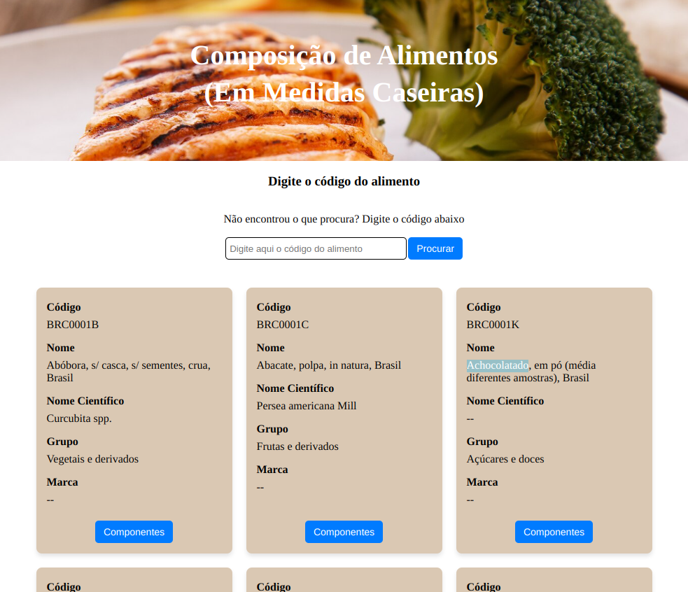
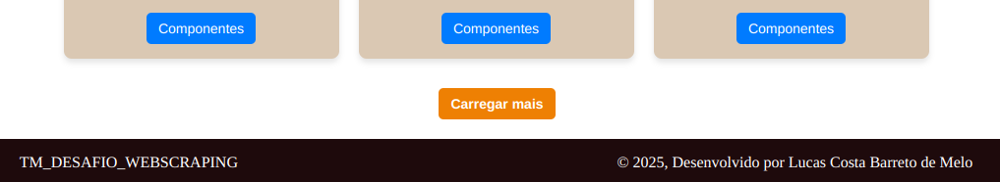
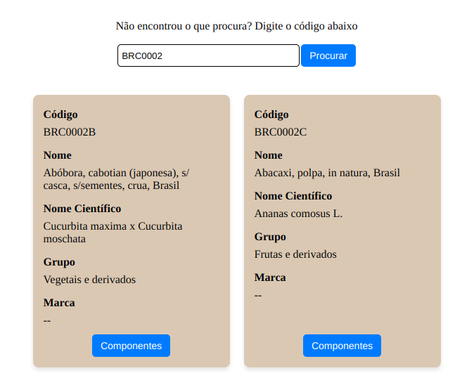
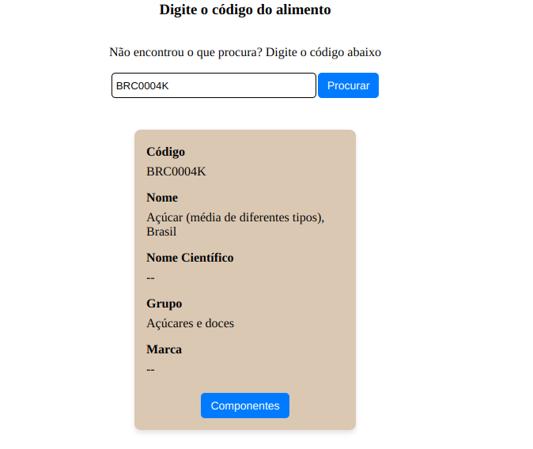
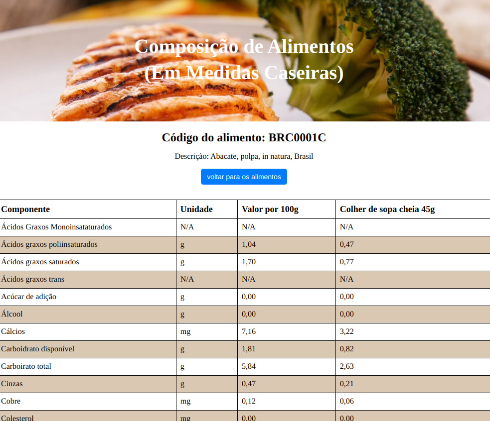
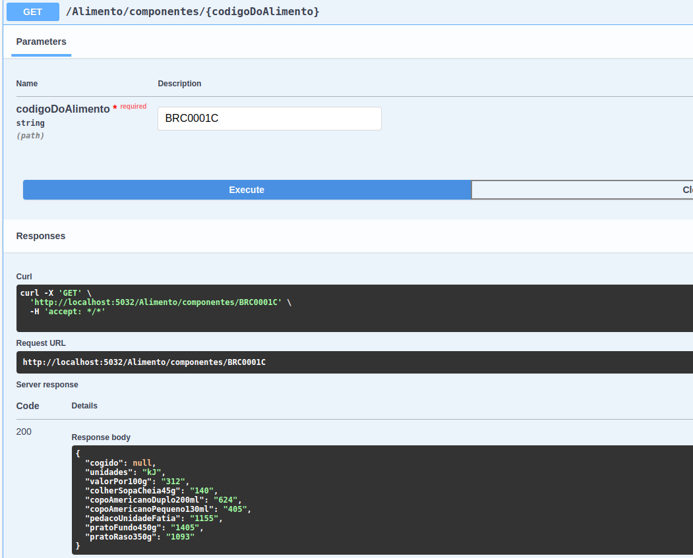
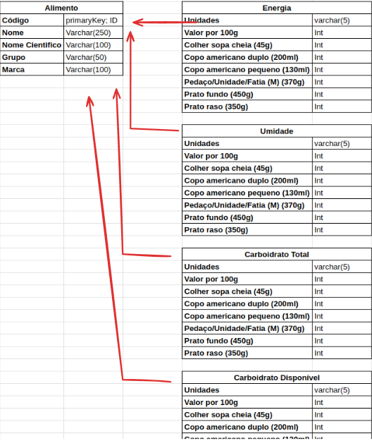

# Projeto de WebScrapping de composição de alimentos

  
Sobre o Desafio

  Este documento contém as diretrizes e requisitos para o desenvolvimento de uma ferramenta de monitoramento de preços com web scraping e interface de usuário. O projeto deve ser desenvolvido utilizando a linguagem C# e seguir as especificações listadas abaixo.

- Link: https://www.tbca.net.br/base-dados/composicao_estatistica.php?pagina=1&atuald=1#

## Requisitos Técnicos

### Ambiente de Desenvolvimento

- _Linguagem Backend:_ C#
- _Framework Backend:_ Utilizar .NET Core, .NET 5 ou .NET 6.
- _Web Scraping:_ Escolher entre Html Agility Pack e AngleSharp para a extração de dados.
- _Banco de Dados:_ Você decide qual banco de dados vai utilizar.
- _Frontend:_ ReactJS

### Funcionalidades

#### Extração de Dados

- Desenvolver uma funcionalidade que extraia informações de alimentos: Código, Nome, Nome Cientifico, Grupo, e todos os Componentes:

  

#### Armazenamento de Dados

- Os dados extraídos devem ser armazenados em um banco de dados. A escolha do banco de dados e a estrutura de tabelas ou arquivos, fica por sua parte.

### Interface de Usuário

- Desenvolver uma interface em ReactJS que permita aos usuários:
- visualizar os alimentos e suas composições.
- Buscar por nome do alimento

## Orientações Gerais

- Priorize a clareza e manutenibilidade do código.
- Documente adequadamente todas as funcionalidades implementadas.
- Utilize padrões de design e boas práticas de programação.

## Entrega do Projeto

- O projeto deve ser entregue em um repositório Git, contendo o código fonte, arquivos de configuração necessários e uma documentação detalhada do projeto.
- Inclua um arquivo README.md com uma visão geral do projeto, instruções de instalação e uso, e uma descrição das tecnologias e técnicas utilizadas.

## Avaliação

O projeto será avaliado com base em:

- Funcionalidade: Todas as funcionalidades requisitadas devem estar implementadas e funcionando corretamente.
- Qualidade do Código: Organização, legibilidade e aderência a boas práticas.
- Documentação: Clareza e completude tanto no código quanto na documentação fornecida.
- Inovação e Uso da Tecnologia: Eficiência na escolha e uso das tecnologias e na solução de problemas.

## Diferenciais

Será um diferencial para esse projeto a implementação de testes unitários e containerização da aplicação (utilizando docker).

Boa sorte e estamos ansiosos para ver sua solução!

## Sobre o projeto

Este projeto tem como objetivo fazer um Web Scraping da Composição de Alimentos (Em Medidas caseiras), ou seja, coletar informações de uma página web e preencher um banco de dados com ela.

## Sobre a aplicação:

A aplicação conta com 3 telas:

- a tela de login
- a tela de alimentos
- a tela de componentes do alimento

Veja abaixo cada uma delas:

1. A tela de Login
   

Aqui, teoricamente, o usuário conseguiria colocar os seus dados de cadastro e após a validação ele faria o login.

Obs: Por enquanto você pode colocar qualquer valor nos campos e-mail e de senha, essa parte não foi desenvolvida pois não era o foco aqui.

2. A tela de alimentos
   

Na tela de alimentos, o usuário consegue ver todos os alimentos registrados no banco de dados, porém limitado a apenas 15 cards por tela. Caso o usuário deseje ver ver mais cards ele pode simplesmente clicar no botão "carregar mais" que se encontra no final da página, veja a imagem abaixo:

Ainda na tela de alimentos, o usuário tem a opção de procurar um alimento pelo código dele. Caso o usuário digite apenas um pedaço do código, a aplicação retornará todos os alimentos que começam com aquela parte do código. Por exemplo, ao digitar o código "BRC0002", aparecerá na tela todos os alimentos que começam com esse código:

Já caso o usuário digite especificamente o código completo, retornará apenas o card desejado:

3. A tela de componentes do alimento
   

## Backend

No backend coloquei alguns endpoints:

O endpoint de Scraping faz uma busca e traz todos os Alimentos listados na primeira página.

Infelizmente os endpoints de adicionar ao banco de dados estão quebrando.

E o endpoint de pegar o Alimento pelo código consegue pegar para o primeiro elemento da tabela BRC0001C

## banco de dados

A ideia aqui é criar uma tabela que contenha as principais informações do Alimento e criar outras tabelas para os demais componentes.

